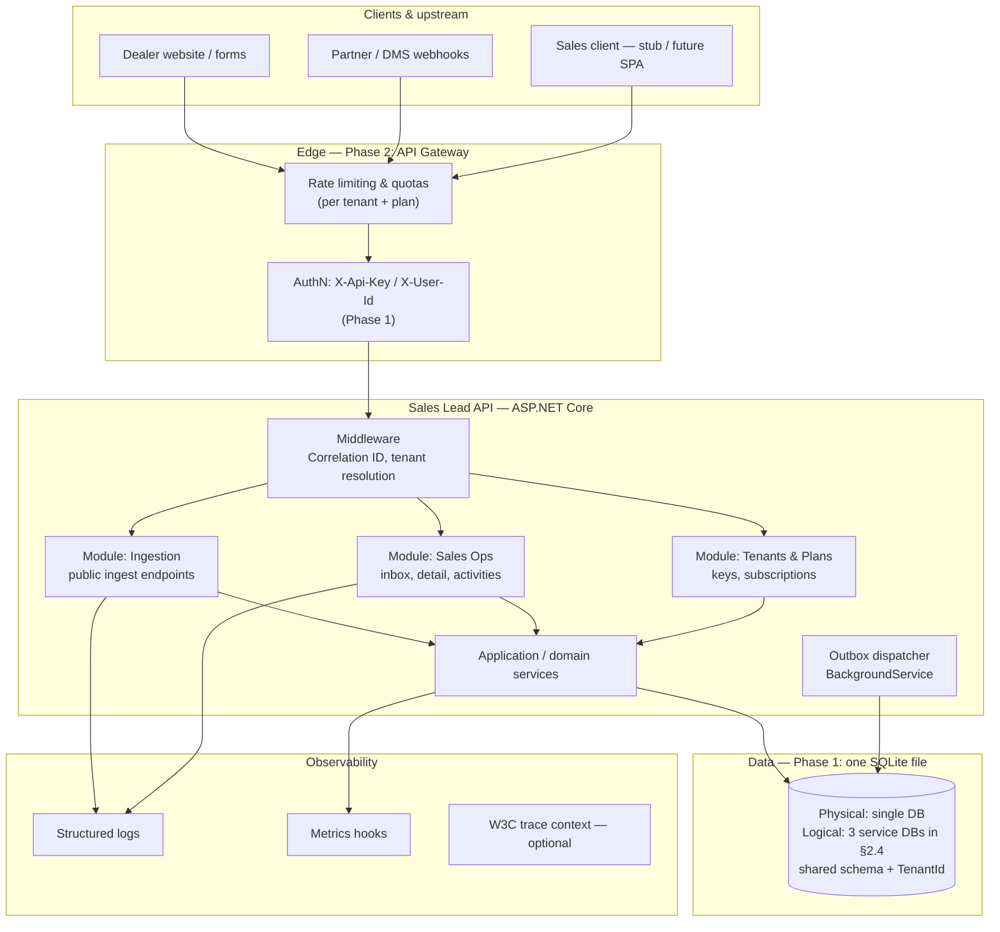
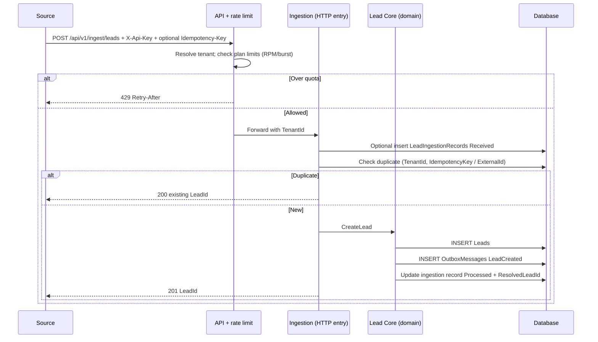
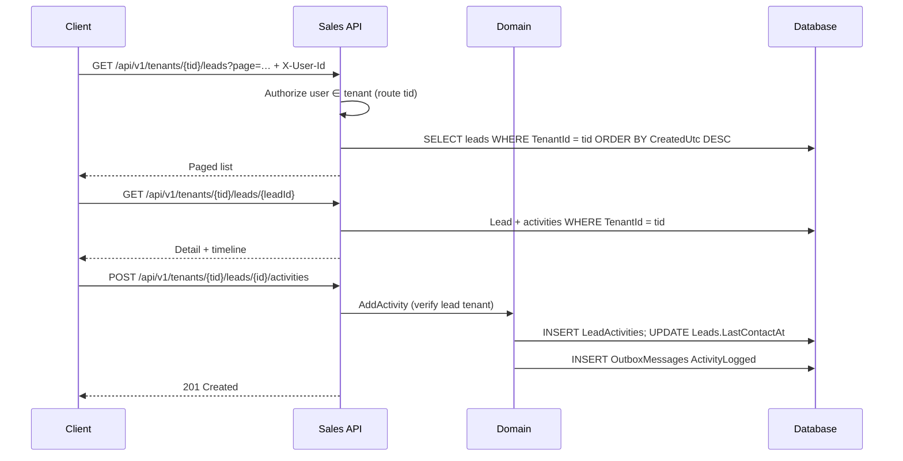
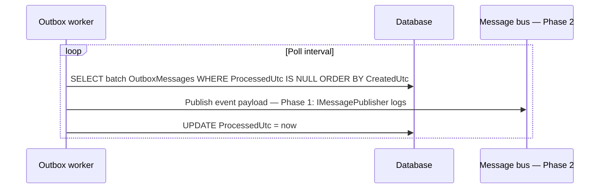
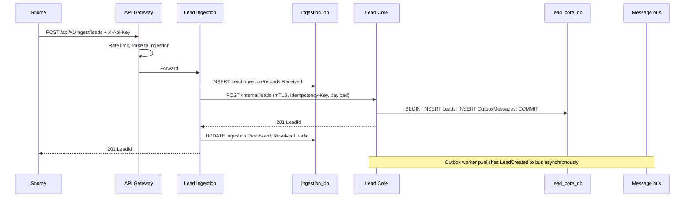
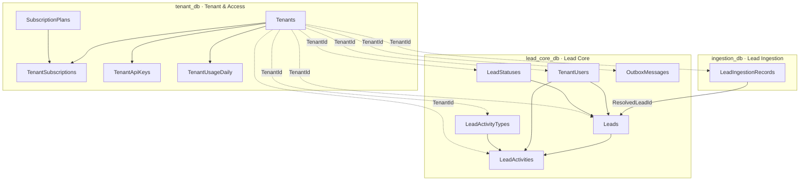
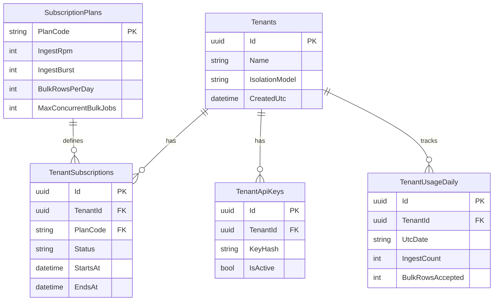
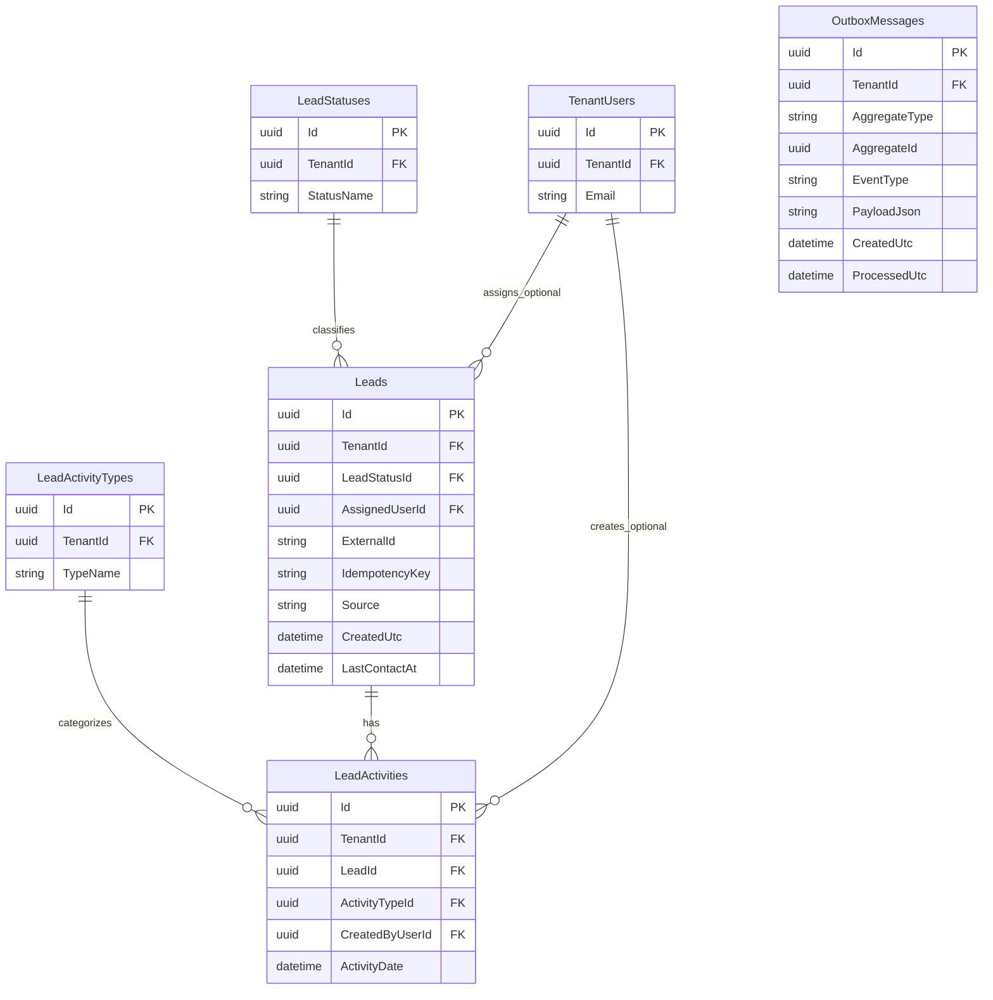
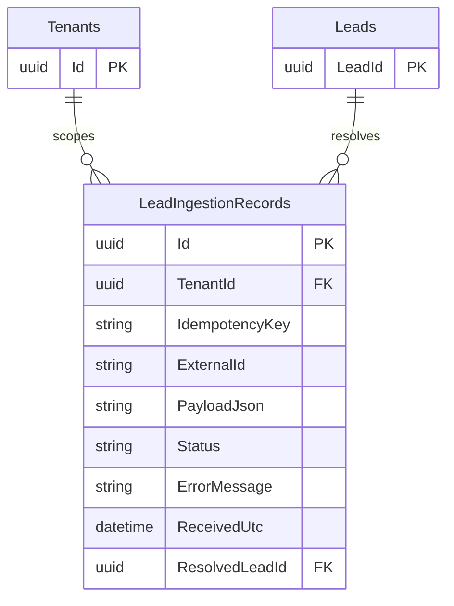

# System Design Document — Sales Lead Management Tool

**Version:** 1.3  
**Product:** Sales Lead Management Tool  
**Scope of implementation:** **Backend API** (REST + persistent database). Client layer stubbed via Swagger / OpenAPI and examples.  
**Requirements alignment:** **Multi-tenant (detailed in §5)**; **data model designed microservice-first (§1.4, §7)**; **Phase 1 code = single modular monolith** consolidating logical databases; ingestion of **incoming** leads; observability; GenAI in design (§10).

---

## Table of Contents

1. [Context & Goals](#1-context--goals)  
2. [Architecture Diagram](#2-architecture-diagram)  
3. [Component Roles](#3-component-roles)  
4. [Data Flow](#4-data-flow)  
5. [Multi-Tenancy & Isolation Models](#5-multi-tenancy--isolation-models)  
6. [Capacity, Traffic Splitting & Package-Based Limits](#6-capacity-traffic-splitting--package-based-limits)  
7. [Data Model](#7-data-model)  
   - [7.2 Logical persistence boundaries](#72-logical-persistence-boundaries)  
   - [7.3 Entity-relationship diagrams](#73-entity-relationship-diagrams-by-bounded-context)  
8. [Technology Choices & Justifications](#8-technology-choices--justifications)  
9. [Observability Strategy](#9-observability-strategy)  
10. [GenAI Assistance — Design Phase](#10-genai-assistance--design-phase)  
11. [Assumptions & Phase 2 Evolution](#11-assumptions--phase-2-evolution)

---

## 1. Context & Goals

### 1.1 Problem

Dealerships need to **track incoming sales leads** from the website and other channels, view them in an **inbox**, open **lead detail** with a **chronological activity timeline**, and **log follow-up activities** — all in a **multi-tenant** SaaS-style platform (many dealerships on one deployment).

### 1.2 Solution Summary

The **data model and persistence boundaries** are defined **as for a microservice platform** (three **logical** databases aligned to **Tenant & Access**, **Lead Ingestion**, and **Lead Core** — see §7.0–§7.1 and §2.3).  

**Phase 1 implementation** deliberately uses a **single deployable ASP.NET Core Web API** (**modular monolith**) and **one physical SQLite database** that **hosts all tables**, while **code structure (namespaces, modules, repositories)** mirrors the **future service cut lines** so extraction is mechanical (§1.4, §8).

Cross-cutting capabilities: **shared-schema multi-tenant** row isolation (`TenantId`), **ingestion** of incoming leads (API key, idempotency), **transactional outbox**, **subscription plans** for **rate limits and quotas**, and **detailed** Phase 2 **microservice runtime** topology (§2.3, §2.5–§2.6).

### 1.3 Non-Goals (Phase 1)

- Multiple **deployable processes** (microservices), API Gateway product, Redis-backed rate limiting, and production message brokers — described in **Phase 2** (§2.3, §11).  
- Full frontend implementation (out of scope for this backend-focused delivery).

### 1.4 Microservice-first logical data model vs monolithic implementation

This document uses a deliberate split between **what we design** and **what we ship in Phase 1**:

| Layer | What this document establishes |
|-------|------------------------------|
| **Logical / design** | Tables are **owned** by exactly one **future microservice** (§7.1). Each service, at runtime, would hold its own **database** (`tenant_db`, `ingestion_db`, `lead_core_db` — §2.3). **No shared writable tables** across services after split. Integration uses **internal APIs** and/or **async messaging** fed by **outbox** (§2.3, §4.5). |
| **Phase 1 physical** | **One SQLite file** and **one EF Core migrations chain** for Phase 1: all tables coexist for **developer velocity**, **atomic cross-module transactions** where still useful (e.g. ingest + lead + outbox in one commit), and a **straightforward EF workflow** (`dotnet ef`, single connection string). |
| **Phase 1 code** | **Modular monolith**: folders or projects per bounded context (**Ingestion**, **Lead Core**, **Tenants & Plans**). **No “god service”** that hides ownership — call paths between modules should resemble **future HTTP/event** boundaries (interfaces / application facades rather than cross-module `DbSet` leakage). |

**Why this is not contradictory:** Physical co-location of tables in SQLite is a **deployment shortcut**, not a change to **who owns which data** or **how services will communicate** after extraction. The **ERDs in §7.3** are the **conceptual contract**; foreign keys that **span logical owners** in Phase 1 (e.g. `LeadIngestionRecords.ResolvedLeadId` → `Leads`) become **soft references + API validation** or **event-driven eventual consistency** when databases are split (§7.0).

### 1.5 How to read this document

1. **Multi-tenancy:** §5 (isolation models, resolution, security, behaviour when split).  
2. **Microservices:** §2.3–§2.6 (topology, consolidation, migration, responsibility matrix).  
3. **Data:** §7 (ownership, logical DB map §7.2, ERDs §7.3, invariants, cross-service notes).  
4. **Implementation reference:** `SalesLead/README.md` documents **one API**, **SQLite** path (`src/SalesLead.Api/Data/saleslead.db`), **`/api/v1`** routes, and **Phase 1** headers (`X-Api-Key`, `X-User-Id`); automated tests validate **tenant isolation** and core flows.

---

## 2. Architecture Diagram

### 2.1 Logical architecture (Phase 1: one process; modules = future microservices)

The diagram shows **one ASP.NET Core host** for Phase 1. **Ingestion**, **Sales Ops**, and **Tenants & Plans** are **logical service boundaries** matching §2.3 and §7.1 — not separate containers until Phase 2.

### 2.2 Deployment view (Phase 1 vs Phase 2)

| Phase | Deployment | Notes |
|-------|------------|--------|
| **1** | One API process + one SQLite file | Modules map to future services; outbox worker in-process. |
| **2** | API Gateway + **Lead Ingestion** service + **Lead Core** service + **Tenant/Plan** read model | Tables migrate with owners; sync via HTTP + message bus fed by **outbox**. |

### 2.3 Phase 2 — Microservice topology (target state, detailed view)

This subsection makes the **split explicit** so the document does not read as “microservices in name only.”

**Physical boundaries**

| Service | Own database (recommended) | Owns tables (from §7.1) |
|---------|----------------------------|-------------------------|
| **Tenant & Access** | Yes — `tenant_db` | `Tenants`, `TenantApiKeys`, `SubscriptionPlans`, `TenantSubscriptions`, `TenantUsageDaily` |
| **Lead Ingestion** | Yes — `ingestion_db` | `LeadIngestionRecords` only |
| **Lead Core** | Yes — `lead_core_db` | `Leads`, `LeadActivities`, `LeadStatuses`, `LeadActivityTypes`, `TenantUsers`, `OutboxMessages` |

No cross-service **shared writable tables**. Read-only replication or cached projections of **plan limits** and **API key → tenant** mapping are allowed at the edge with **TTL** to avoid hammering Tenant service on every request.

**Who writes the lead?**

- **Lead Core** is the **only** service that inserts/updates **`Leads`** and **`LeadActivities`** and the **transactional outbox** for domain events (`LeadCreated`, `ActivityLogged`, …).
- **Lead Ingestion** persists **staging / audit** in its own DB (`LeadIngestionRecords`), then **invokes Lead Core** via a **synchronous internal API** (e.g. `POST /internal/leads`) *or* publishes a **`CreateLead`** command to a queue **consumed by Lead Core** (async path under overload). The design choice is:

  | Pattern | When | Trade-off |
  |---------|------|-----------|
  | **Sync internal HTTP** | Default for low latency ingest | Ingestion must handle Lead Core **503** with **retry + idempotency** (same `Idempotency-Key`). |
  | **Async command + queue** | Burst / bulk | Caller may receive **202 Accepted** + job id; Lead Core processes at-least-once; **idempotency** on consumer. |

**Events leaving Lead Core**

- **`OutboxMessages`** stays in **Lead Core DB** only. A **dedicated outbox publisher** (worker) in the Lead Core cluster reads pending rows and publishes to **Kafka / RabbitMQ / Azure Service Bus** (Phase 2). Downstream consumers (search, CRM, DWH) subscribe to the bus — they **do not** read Lead Core’s DB.

**Service-to-service authentication (Phase 2)**

- **mTLS** or **OAuth2 client credentials** (short-lived tokens) between Ingestion → Lead Core and workers → bus; **no** trust based on caller-supplied `TenantId` without cryptographic proof tied to API key validation at gateway/ingestion.

**Failure and consistency**

- **Ingestion ↔ Lead Core** is **eventually consistent** if async queue is used; **strong consistency** for “lead row exists” only after Lead Core commits.
- **Duplicate delivery** is acceptable if Lead Core enforces **`(TenantId, IdempotencyKey)`** / **`(TenantId, ExternalId)`** as documented.
- **Poison messages** go to a **DLQ** after N retries; **operational runbook** (alert + replay) is Phase 2 ops.

**Gateway role in Phase 2**

- Terminates TLS, **WAF**, **per-tenant rate limit** (Redis-backed), routes **`/api/v1/ingest/*`** to Ingestion and **`/api/v1/tenants/*` (sales)** to Lead Core; may cache **plan-derived limits** with short TTL.

### 2.4 Phase 1 — Physical consolidation of logically separate data

Phase 1 **does not** change the **logical** microservice map in §7.1. It **consolidates** physical storage:

| Logical database (target) | Tables | Phase 1 hosting |
|---------------------------|--------|-------------------|
| `tenant_db` | `Tenants`, `TenantApiKeys`, `SubscriptionPlans`, `TenantSubscriptions`, `TenantUsageDaily` | Same SQLite file as below |
| `ingestion_db` | `LeadIngestionRecords` | Same SQLite file |
| `lead_core_db` | `Leads`, `LeadActivities`, `LeadStatuses`, `LeadActivityTypes`, `TenantUsers`, `OutboxMessages` | Same SQLite file |

**Implementation rules (monolith):**

- Prefer **one `DbContext`** with **partial configurations** or **separate EF configurations per module** to keep **mental ownership** aligned with §7.1.  
- Application code **should not** treat “one database” as permission to **violate ownership** (e.g. Lead Core should not silently own ingestion staging rules; Ingestion should not mutate `OutboxMessages` except via documented hand-off to Lead Core patterns).  
- **Tests** should assert **tenant isolation** at the **HTTP/API** boundary (externally observable), not only at SQL level.

### 2.5 Migration path — from modular monolith to deployed microservices

Ordered steps (lowest-risk extraction path):

1. **Freeze public REST contracts** (OpenAPI) per module; add **internal DTOs** for cross-module calls today that become **HTTP** tomorrow.  
2. **Split EF Core** into **three `DbContext`** types (still pointing at one SQLite file **or** schema prefixes) to enforce **compile-time separation**; optionally **multiple migration assemblies** later.  
3. **Replace in-process calls** between Ingestion and Lead Core with **`HttpClient`** (dev: same host, different route prefixes) behind **`ILeadCoreClient`** / **`IIngestionClient`** interfaces.  
4. **Move SQLite files** (or PostgreSQL databases) to **separate connection strings** per service; run **ingestion** and **lead core** as **separate processes**; keep **Tenant** data accessible via **read API + cache** from Ingestion/Gateway.  
5. **Enable message bus** for outbox publisher; move **outbox worker** to Lead Core cluster only.  
6. **Introduce API Gateway** in front; move **rate limiting** to Redis-backed policy at edge.

This path preserves **domain rules** (`TenantId`, idempotency, outbox) while changing **only deployment and transport**.

### 2.6 Microservice responsibility matrix (runtime, Phase 2)

| Concern | Tenant & Access | Lead Ingestion | Lead Core |
|---------|-----------------|----------------|-----------|
| **Stores** | Plans, subscriptions, usage, API key metadata | Ingest staging / audit | Leads, activities, lookups, users, outbox |
| **Public ingress** | Admin/B2B APIs (optional); mostly internal | **`/api/v1/ingest/*`** | **`/api/v1/tenants/*` (sales)** |
| **Tenant resolution** | Source of truth for key → tenant; plan limits | Validates API key via Tenant service **or** cached projection | Phase 1: **`X-User-Id`** + route `tenantId` → `TenantUsers`; production may use **JWT** with same rules |
| **Writes `Leads`** | No | No (delegates to Lead Core) | **Yes (sole writer)** |
| **Publishes domain events** | No | No | **Yes (via outbox only)** |
| **Scaling knob** | Low churn; small replicas | **Elastic** with ingest load | **Elastic** with read/write CRM load |

**Versioning:** Internal APIs use **URL versioning** (`/internal/v1/...`) or **media type**; events carry **`schemaVersion`** in outbox payload for forward compatibility.

---

## 3. Component Roles

**Phase 1 HTTP surface (implemented):** all REST routes are under **`/api/v1`**. Ingest uses header **`X-Api-Key`** (hashed against `TenantApiKeys`). Sales uses **`X-User-Id`** plus **`/api/v1/tenants/{tenantId}/...`** so the middleware can bind the user to the route tenant (JWT is a documented Phase 2 / production evolution — see §5.4).

**Persistence ownership:** INSERT/UPDATE to **`Leads`**, **`LeadActivities`**, and **`OutboxMessages`** are owned by **Lead Core** (§2.3, §2.6, §7.1). The table below describes **which module exposes which HTTP surface** and **call flow**. The **Ingestion module** is the **ingress façade** for **`/api/v1/ingest/*`**; it does **not** become the long-term writer of lead or outbox rows after DB split — only **Lead Core** commits to `lead_core_db`.

| Component | Responsibility |
|-----------|----------------|
| **API Gateway (Phase 2)** | TLS termination, WAF, global rate limits; in Phase 1 emulated by ASP.NET middleware. |
| **Rate limiting & quotas** | Enforce **per-tenant** limits derived from **subscription plan** (ingest RPM, burst, daily caps). Phase 1: in-memory token bucket + DB-backed plan config; Phase 2: distributed store (e.g. Redis). |
| **AuthN** | **Ingest:** **`X-Api-Key`** → `TenantApiKeys` (hash lookup) → `TenantId`. **Sales:** **`X-User-Id`** → must exist in **`TenantUsers`** for the **route** `tenantId`. |
| **Middleware** | Correlation ID (`X-Correlation-ID`), tenant context, optional request logging scope. |
| **Ingestion module** | **Phase 1 (modular monolith):** HTTP entry for ingest routes; accept incoming leads (JSON), validate, **idempotency**, optional `LeadIngestionRecords` audit row; **delegate persistence** to **Lead Core** domain/application services so **`Leads`** and **`OutboxMessages`** commit **atomically** in one transaction (same SQLite file — logical ownership §7.1). **Phase 2:** Write only **`LeadIngestionRecords`** in **`ingestion_db`**, then invoke Lead Core per §2.3 / §4.5 (**sync internal API** or **async command**); **does not** INSERT into **`Leads`** or **`OutboxMessages`**. |
| **Sales Ops module** | Paginated **inbox**, **lead detail** with activities ordered by time, **create activity**, update `LastContactAt`, outbox for `ActivityLogged`. |
| **Tenants & Plans module** | Manage or seed `Tenants`, `TenantApiKeys`, `SubscriptionPlans`, `TenantSubscriptions`. |
| **Domain / application services** | Enforce invariants: every command/query scoped by `TenantId`; activity’s tenant matches lead’s tenant. |
| **Outbox dispatcher** | Poll `OutboxMessages` where `ProcessedUtc` is null; publish (Phase 1: log / noop bus abstraction); mark processed — supports reliable integration later. |
| **SQLite database** | **Phase 1:** single file hosting **all** tables; **logical** ownership still follows §7.1 / §2.4. Indexes optimized for `(TenantId, …)`. |
| **Swagger / OpenAPI** | Contract for API consumers and integrators; curl examples in README. |

---

## 4. Data Flow

### 4.1 Incoming lead (website / partner) — synchronous happy path

**Phase 1:** **Ingestion** is the **HTTP / orchestration** boundary; **`Leads`** and **`OutboxMessages`** INSERTs run inside **Lead Core** code paths (same process, one transaction). **Phase 2:** only **Lead Core** commits to **`lead_core_db`**; see §2.3 and §4.5.

### 4.2 Sales user — inbox, detail, log activity

### 4.3 Outbox dispatch (async, same process in Phase 1)

### 4.4 Bulk / high-volume ingest (evolution)

**Phase 1 (implemented):** `POST /api/v1/ingest/leads/bulk` accepts multiple payloads in one request and returns per-item outcomes (same idempotency/rate-limit semantics as single ingest, with optional `Idempotency-Key` suffix per item).

Under extreme load, the API can **ack quickly** and enqueue work (Phase 2: message queue; optional background worker). This **splits** the **HTTP thread** from **database write burst**, preventing a single tenant from starving others when combined with **per-tenant fair queues** and limits (§6).

### 4.5 Phase 2 — Ingest split across services (sync internal API)

This sequence matches §2.3: **only Lead Core** writes `Leads` + `OutboxMessages`.

---

## 5. Multi-Tenancy & Isolation Models

### 5.1 Tenant definition

A **tenant** is a **dealership** (or dealer group) that owns leads, users, and configuration.

### 5.2 Three primary isolation patterns (industry standard)

| Model | Description | When to use |
|-------|-------------|-------------|
| **Shared schema + `TenantId`** | All tenants share tables; every row carries `TenantId`; queries always filter by tenant. | **Phase 1 (this design)** — lowest ops cost, fastest delivery, suitable for most tenants. |
| **Per-schema** | Each tenant (or group) has its own schema in one database instance; optional `TenantId` kept for safety. | **Noisy-neighbor** mitigation, simpler backup per tenant without separate server. |
| **Per-database** | Dedicated database per Professional-tier or regulatory customer. | **Strong isolation**, compliance, independent scale; higher cost. |

### 5.3 How this design supports all three

- **`Tenants.IsolationModel`** (see §7) records the **deployment mode** for routing: `SharedSchema`, `DedicatedSchema`, or `DedicatedDatabase`.  
- **Phase 1 implementation** uses **SharedSchema** only at the **row** level (all tenants in one physical SQLite schema); **connection routing** for dedicated DB/schema is a **configuration + factory** change, not a domain redesign.  
- **API and domain rules** remain: **never** return or mutate data outside the resolved tenant context.

### 5.4 Tenant resolution — trusted context (detailed)

Multi-tenancy is only safe if **`TenantId` never comes from an untrusted client alone**.

| Entry path | How `TenantId` is established | Must reject |
|------------|-------------------------------|-------------|
| **Ingest (website / partner)** | Client presents **API key** → lookup **`TenantApiKeys`** (hash) → `TenantId`. Optionally validate **active subscription** and **plan limits** (§6). | Missing/invalid key; key for suspended tenant. |
| **Sales (internal users)** | **Phase 1 (implemented):** header **`X-User-Id`** must match a **`TenantUsers`** row for the **`tenantId`** in **`/api/v1/tenants/{tenantId}/...`**. **Production / Phase 2:** JWT (or similar) carrying **`UserId`** + **`TenantId`** with the same path-equality rule. | User not in tenant; inactive user; **`tenantId`** in path ≠ tenant bound to user. |
| **Service-to-service (Phase 2)** | **mTLS / client credentials**; internal token includes **acting tenant** only after gateway or Ingestion has **already** bound the public key to that tenant. | Blind trust of `X-Tenant-Id` from Internet without crypto binding. |

**Rule:** After resolution, **`ITenantContext`** (or equivalent) flows through **handlers**; repositories require **`TenantId`** explicitly or from that context — **no** “global query all leads.”

### 5.5 Data isolation — rules and anti-patterns

**Required patterns**

- Every **business** table row for tenants carries **`TenantId`** (except global catalog tables like `SubscriptionPlans` which are not tenant-owned data).  
- **Lookups** (`LeadStatuses`, `LeadActivityTypes`) are **tenant-scoped rows** (seeded per tenant) so status/type IDs are not ambiguous across dealerships.  
- **Unique** constraints for ingest idempotency are **scoped**: `(TenantId, IdempotencyKey)`, `(TenantId, ExternalId)`.  
- **Activities** inherit tenant from parent **lead**; service layer **asserts** equality before insert.

**Anti-patterns (must not appear in implementation)**

- Endpoint **`GET /leads`** without tenant scope.  
- Accepting **`tenantId`** from JSON body for **authorization** on sales APIs.  
- Reusing **global** status/type IDs shared across all tenants without `TenantId` on the lookup row (undermines tenant-scoped data model clarity).  
- **Cross-tenant** `JOIN` in reporting without explicit **tenant filter** in the same query plan.

### 5.6 Multi-tenancy when microservices are deployed (Phase 2)

Each **microservice** must **re-validate** tenant scope for its own data:

- **Lead Core** authorizes every query/mutation against **`TenantId`** from token or internal call context; **internal API** from Ingestion includes **tenant** established at the edge.  
- **Lead Ingestion** never inserts into **`Leads`** directly after split; it calls Lead Core with **the same tenant** it resolved from the API key.  
- **Tenant & Access** service is the **authority** for **keys and plans**; other services use **cached read models** with **TTL** and **eventual consistency** acceptable for limits (stale-by-seconds), not for **lead PII** writes.

**Noisy neighbor:** tenants on **DedicatedDatabase** / **DedicatedSchema** (§5.2) reduce blast radius; **per-tenant rate limits** (§6) cap aggregate abuse on shared pools.

### 5.7 Audit, compliance, and data subject angles (brief)

- **Activity log** on leads supports **operational audit** (“who did what, when”).  
- **LeadIngestionRecords** retain **payload** for **ingest debugging**; retention policy (Phase 2) may **truncate/redact** PII per regulation.  
- **IsolationModel = DedicatedDatabase** supports **data residency** commitments for enterprise dealers.

---

## 6. Capacity, Traffic Splitting & Package-Based Limits

### 6.1 Design stance on “how much load”

Exact throughput depends on hardware and profiling. This architecture **separates concerns** so capacity can be increased **horizontally** (stateless API replicas) and **asynchronously** (queue + workers), and **vertically** (read replicas for queries in Phase 2).

**Illustrative baseline assumptions** (documented for capacity planning; tunable):

| Dimension | Assumed baseline |
|-----------|------------------|
| Tenants (active) | Hundreds to low thousands on one regional deployment |
| Ingest sustained | Tens to low hundreds RPS aggregate at API tier before queue recommended |
| Read (inbox) | Dominated by indexed `(TenantId, CreatedUtc)` queries; pagination mandatory |

### 6.2 Traffic splitting (logical flows)

| Flow | Purpose | Bottleneck mitigation |
|------|---------|------------------------|
| **Ingest (write-heavy)** | External lead capture | Rate limit + optional async queue; idempotency reduces duplicate writes |
| **Sales read/write** | UI operations | Pagination, indexes, future read replica |
| **Outbox** | Downstream integration | Separate worker scale; does not block HTTP response path after commit |

### 6.3 Subscription packages & rate limits (example policy)

**Plans** are stored in `SubscriptionPlans`; **tenant’s active plan** in `TenantSubscriptions`. Limits are **configuration**, not hard-coded magic numbers in services.

| Limit | Essential | Professional |
|-------|-----------|--------------|
| Ingest requests | 60 RPM, burst 20 | 600 RPM, burst 100 |
| Bulk rows / day | 5,000 | 100,000 |
| Concurrent bulk jobs | 1 | 5 |

**429 Too Many Requests** with `Retry-After` when exceeded. Professional can additionally use **higher priority** in a future queue (Phase 2).

### 6.4 Avoiding a global bottleneck

- **Do not** serialize all tenants on a single DB row or global lock for rate limiting — Phase 1 uses **per-tenant in-memory buckets**; Phase 2 moves to **distributed counters** (Redis) at the gateway.  
- **Fairness:** per-tenant caps prevent one dealership from exhausting shared pools.  
- **Hot tenants:** `IsolationModel = DedicatedDatabase` (or dedicated schema) **offloads** them from shared resources.

---

## 7. Data Model

### 7.0 Microservice-first data modeling — purpose of this section

The **data model is designed first for a split microservice deployment**, not “a monolith schema that we later force apart.” Consequences:

1. **Every table has exactly one owning service** (§7.1). That owner is the **only** service allowed to **author** rows in that table in Phase 2 (except controlled **replication** / read models).  
2. The **ERDs (§7.3)** express **domain relationships**. After physical split, **foreign keys across owners** may become **logical references** enforced by **API contracts** and **idempotency** (e.g. `LeadIngestionRecords.ResolvedLeadId` still identifies a lead in Lead Core, but without a DB-level FK across servers).  
3. **Phase 1 SQLite** may retain **DB-level FKs** for **developer convenience** and **transactional integrity** inside one file; the document treats this as **implementation detail**, not a change to **ownership**.  
4. **Multi-tenancy** is modeled **inside** each bounded context: all tenant-owned rows carry **`TenantId`**; **Tenant & Access** owns the **tenant registry** and **plan entitlements**.

### 7.1 Service ownership (persistence boundaries)

| Logical future service | Tables | Target physical store (Phase 2) |
|------------------------|--------|----------------------------------|
| **Tenant & Access** | `Tenants`, `TenantApiKeys`, `SubscriptionPlans`, `TenantSubscriptions`, `TenantUsageDaily` | `tenant_db` |
| **Lead Ingestion** | `LeadIngestionRecords` | `ingestion_db` |
| **Lead Core** | `Leads`, `LeadActivities`, `LeadStatuses`, `LeadActivityTypes`, `TenantUsers`, `OutboxMessages` | `lead_core_db` |

**Phase 1 implementation:** one EF Core **`DbContext`** (or split contexts, same file) and **one migrations chain**; **namespaces / folders** mirror the table ownership above so **extracting migrations per service** is straightforward.

### 7.2 Logical persistence boundaries

**Phase 2 target (conceptual):** the diagram maps **which logical database owns which tables** and how **cross-service references** behave after split (dashed: **not** a guaranteed cross-database FK — enforced by **API / idempotency** instead). Phase 1 still hosts **all tables in one SQLite file**; this view is a **reference map** for service extraction.

**Legend:** Solid arrows are **within-service** relationships in the target topology. Dashed **`TenantId`** lines mean **every row** in Lead Core / Ingestion tenant-scoped tables references **`Tenants.Id`** — drawn once here to avoid repeating the same hub in every ERD. **`OutboxMessages`** is only linked to **`Tenants`** at FK level; **`AggregateId` / payload** reference leads or other aggregates **without** a separate FK edge to **`Leads`** (see implementation).

### 7.3 Entity-relationship diagrams by bounded context

ERDs are **split by owning service** so each diagram stays readable. **Multi-tenant scoping:** unless stated otherwise, every table with `TenantId` references **`Tenants`** (see §7.3.1); cross-database **`TenantId`** is a **logical** link after split.

#### 7.3.1 Tenant & Access — `tenant_db`

#### 7.3.2 Lead Core — `lead_core_db`

**Note:** `Leads`, `LeadActivities`, `LeadStatuses`, `LeadActivityTypes`, `TenantUsers`, and `OutboxMessages` each include **`TenantId` → `Tenants.Id`** (owner: Tenant & Access). That edge is **omitted** below to keep the diagram focused on **intra–Lead Core** relationships. **`OutboxMessages`** does not FK to **`Leads`**; **`AggregateId`** (and event payload) identify the aggregate for **`LeadCreated`** / **`ActivityLogged`** events.

Table names in SQLite match EF: **`LeadActivityTypes`**, **`TenantUsers`** (not generic `ActivityTypes` / `Users`).

#### 7.3.3 Lead Ingestion — `ingestion_db`

**Cross-service:** `ResolvedLeadId` identifies a row in **`Leads`** (Lead Core). In Phase 1 SQLite this may be a **real FK**; after split it becomes a **stored identifier** validated when Ingestion calls Lead Core (§2.3, §7.0).

### 7.4 Key tables (summary)

| Table | Purpose |
|-------|---------|
| **Tenants** | Dealership; **`IsolationModel`**: `SharedSchema` / `DedicatedSchema` / `DedicatedDatabase`; optional display name. |
| **SubscriptionPlans** | Catalog of plans with **default limits** (ingest RPM, burst, bulk day cap, concurrent jobs). |
| **TenantSubscriptions** | Which plan a tenant is on; active window. |
| **TenantUsageDaily** | Counters for **quota enforcement** and auditing (ingest count, bulk rows accepted) per UTC day. |
| **TenantApiKeys** | Hashed keys for ingest authentication. |
| **LeadStatuses / LeadActivityTypes** | Tenant-scoped lookups (seeded per tenant); physical tables **`LeadStatuses`**, **`LeadActivityTypes`**. |
| **TenantUsers** | Sales users (`TenantUsers` table); unique **email** and **username** per tenant. |
| **Leads** | Core lead entity; optional **`AssignedUserId`** → `TenantUsers`; `ExternalId` / `IdempotencyKey` for inbound deduplication; `Source`, contact fields (`FirstName`, `LastName`, `Email`, …). |
| **LeadActivities** | Chronological follow-ups; `TenantId` must match parent lead; optional **`CreatedByUserId`** → `TenantUsers`. |
| **LeadIngestionRecords** | Staging / audit: `PayloadJson`, `Status`, `ReceivedUtc`, optional **`IdempotencyKey`** / **`ExternalId`**, **`ErrorMessage`**, **`ResolvedLeadId`**. |
| **OutboxMessages** | Transactional outbox for `LeadCreated`, `ActivityLogged`, etc.; **`AggregateId`** / **`AggregateType`** tie the event to a domain aggregate (no FK to `Leads` in schema). |

### 7.5 Indexes & constraints (high level)

- `Leads`: `(TenantId, CreatedUtc)`, `(TenantId, LeadStatusId)`, unique `(TenantId, IdempotencyKey)` / `(TenantId, ExternalId)` (nullable columns participate where defined in EF).  
- `LeadActivities`: `(LeadId, ActivityDate ASC)`.  
- `TenantApiKeys`: unique `KeyHash`.  
- `OutboxMessages`: `(ProcessedUtc)` partial / filtered for dispatcher.  
- `TenantUsageDaily`: unique `(TenantId, UtcDate)`.

### 7.6 Critical invariants

1. Every business query/command includes **`TenantId`** from trusted context (token or API key), never from unchecked client body alone.  
2. **`LeadActivities.TenantId` = `Leads.TenantId`** for the same `LeadId`.  
3. **Outbox rows** inserted in the **same transaction** as the domain change they describe.

---

## 8. Technology Choices & Justifications

| Technology | Role | Justification |
|------------|------|---------------|
| **.NET 8 LTS** | Runtime | Long-term support, performance, strong typing, excellent async I/O for APIs. |
| **ASP.NET Core Web API** | HTTP layer | Mature, OpenAPI/Swagger, middleware pipeline, health checks, rate limiting primitives. |
| **Entity Framework Core 8** | ORM | Rapid schema evolution, migrations, provider swap to PostgreSQL/Oracle for production. |
| **SQLite** | Phase 1 database | Zero external dependencies; portable for local development and CI; EF abstracts provider. |
| **xUnit** | Unit / integration tests | De facto standard in .NET; clean fixture model for testing WebApplicationFactory. |
| **Swashbuckle (OpenAPI)** | API documentation | Interactive exploration; contract for stub client. |
| **Serilog** | Logging | Structured logs, sinks, correlation-friendly properties. |
| **FluentValidation** *(optional)* | Input validation | Declarative rules, testable validators for ingest DTOs. **Phase 1 implementation does not reference FluentValidation** — validation is manual / data annotations in the API as needed. |

**Why is Phase 1 a monolith if the data model is microservice-first?** The **logical** platform is microservices (§1.4, §7.0); **Phase 1** is delivered as a **modular monolith** so the team can **build, run, and test** quickly while preserving **clear extraction boundaries** (§2.4–§2.6). This is an **intentional** trade-off, not an accidental “big ball of mud.”

**Why not Redis/Kafka in Phase 1?** Keeps the repo self-contained; **interfaces** for rate limiting and messaging allow **drop-in** Redis / broker in Phase 2 **without** changing tenant rules or outbox semantics (§11).

---

## 9. Observability Strategy

### 9.1 Logging

- **Structured logging** (Serilog): JSON or key-value properties including **`TenantId`**, **`CorrelationId`**, endpoint, outcome, duration ms.  
- **Levels:** `Information` for successful business events (lead created, activity logged); `Warning` for throttling and validation; `Error` for exceptions with stack (sanitized in production).  
- **PII:** do not log full lead email/phone at `Information`; prefer lead IDs.  
- Middleware generates/propagates **`X-Correlation-ID`**.

### 9.2 Metrics (hooks)

Counters and histograms (exposed via `/metrics` in production with Prometheus-compatible exporter when adopted):

| Metric | Type | Purpose |
|--------|------|---------|
| `http_requests_total` | Counter | Volume by route, status, tenant (low-cardinality tenant bucket or aggregate only if cardinality risk). |
| `ingest_requests_throttled_total` | Counter | Rate-limit hits per plan. |
| `lead_created_total` | Counter | Business throughput. |
| `outbox_pending_gauge` | Gauge | Backlog monitoring. |
| `db_command_duration_seconds` | Histogram | EF/SQL performance. |

### 9.3 Tracing

- ASP.NET Core **OpenTelemetry** optional: W3C **traceparent** propagation; spans for HTTP inbound, EF Core, outbox dispatch.  
- Phase 1 minimum: correlation ID in logs; Phase 2: full trace to gateway and workers.

### 9.4 Health

- **`GET /health/live`**: process up.  
- **`GET /health/ready`**: database can connect (mapped at **root**, not under `/api/v1` — see `Program.cs`).

---

## 10. GenAI Assistance — Design Phase

### 10.1 How GenAI was used

A **generative AI assistant** (e.g. **Cursor**) was used as a **design and implementation sparring partner**, not as an unreviewed source of truth—the same framing as *AI Collaboration Narrative* in the project **README**. The aim was a **clear, auditable** result: explicit tenancy rules, a data model that can be split along service boundaries later, and alignment with a **verifiable Phase 1** (one ASP.NET Core API, one SQLite database, middleware-based auth headers, transactional outbox with an in-process dispatcher, tests that assert **tenant isolation** and core flows). Activities included:

1. **Brainstorming** multi-tenant patterns (shared schema vs dedicated schema vs dedicated database) and **explicit trade-offs** for automotive retail—rather than a single “happy path” sketch.  
2. **Stress-testing** the requirement wording (“**incoming** leads”) to ensure **ingestion**, **idempotency**, and **bulk** paths were not reduced to manual CRUD only.  
3. **Structuring** this document around logical **service ownership**, **traffic split**, **package-based limits** (Essential vs. Professional as **configuration** on subscription plans), and **bottleneck** mitigation; **drafting** Mermaid diagrams, then **manual edits** for consistency with stated constraints (SQLite, single API, backend-only).  
4. **Reviewing** for common architectural pitfalls: missing `TenantId`, weak FK stories, “microservice” claims without **outbox** or **clear table ownership**.  
5. **Consolidating** feedback from peer review (e.g. emphasis on **data model** and **operational** tenancy) into explicit sections §5–§7.  
6. **Clarifying** the **logical-vs-physical** split: **microservice-first data model** with **monolithic Phase 1 implementation** (§1.4–§1.5, §2.4) so the design cannot be read as contradictory.

### 10.2 Human verification

The author **verified** every architectural claim against:

- The product and delivery scope for the **Sales Lead Management Tool** (backend, GenAI disclosure where applicable).  
- Feasibility for a **short implementation window** (**modular monolith** delivery vs premature **distributed** microservices), while preserving **microservice-first** persistence boundaries (§1.4).  
- **Security and isolation** rules: ingest resolves tenant from the **API key**; sales routes require a user that belongs to the **route** tenant (**`X-Api-Key`** / **`X-User-Id`** in Phase 1; JWT named as production evolution in §5.4 / §11).  
- **`dotnet build`**, **`dotnet test`**, and **runtime checks** (e.g. Swagger and manual requests against seeded tenants), run after meaningful changes: used to **verify that the design assumptions documented here remained valid** as they were exercised through Phase 1 implementation—not only as a generic “green build” signal.  
- **Consistency** with **`docs/API_CONTRACT.md`** and this document once the contract existed; **rejection** of suggestions that would make Phase 2 scale components (**Redis**, message **brokers**, etc.) **mandatory** runtime dependencies for Phase 1.  
- **Operational realism without scope creep**: **per-tenant** rate limiting driven from **subscription plan** data (Essential vs. Professional as configuration), matching the README’s implementation stance.

### 10.3 What GenAI did *not* do

- No production deployment or load testing on behalf of the author.  
- Final **technology commitment** and **numeric rate-limit examples** were chosen and owned by the author as **documented assumptions** (§6).

---

## 11. Assumptions & Phase 2 Evolution

| Topic | Assumption / next step |
|-------|-------------------------|
| **Auth** | Phase 1 uses **`X-Api-Key`** (ingest) and **`X-User-Id`** (sales); production may add **JWT** for sales and **rotated** API keys (§5.4, §3). |
| **Rate limiting** | Phase 1 in-memory per instance; Phase 2 Redis + gateway for cluster-wide accuracy. |
| **Messaging** | Outbox publisher logs or interface; Phase 2 Kafka/RabbitMQ/Azure Service Bus. |
| **Read scale** | Add read replicas or CQRS read model if inbox queries dominate. |
| **Tenancy** | Professional-tier tenants may move to **DedicatedDatabase** using `IsolationModel` without changing public REST semantics. |
| **Logical → physical split** | Phase 1: **one SQLite** + **one API**; extraction per §2.5 (multiple `DbContext`, then separate connection strings and processes). |
| **Cross-service FKs** | After split, replace cross-database FKs with **API-enforced** references + **idempotent** commands; see §7.0. |

---

**Document status:** Aligned with **Phase 1** implementation in `SalesLead/` (single API, SQLite, `/api/v1`, `X-Api-Key` / `X-User-Id`, tables per §7.4).  
**Next step:** Keep **tests** traceable to §3–§7 and **§5.5** (isolation); evolve auth/routes per §11 when hardening for production.
